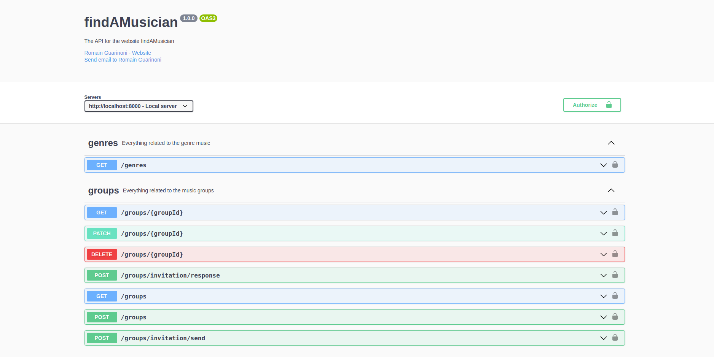

[](https://img.shields.io/github/workflow/status/RomainGuarinoni/findAMusician/tests/main)
[](https://img.shields.io/snyk/vulnerabilities/github/RomainGuarinoni/findAMusician)
[](https://img.shields.io/github/commit-activity/m/RomainGuarinoni/findAMusician)
[](https://img.shields.io/github/license/RomainGuarinoni/findAMusician)
[](https://codecov.io/gh/RomainGuarinoni/findAMusician/)
[](https://img.shields.io/github/issues/RomainGuarinoni/findAMusician)
[](https://img.shields.io/github/issues-pr/RomainGuarinoni/findAMusician)
<br />

<div align="center">
  <a href="https://github.com/RomainGuarinoni/findAMusician#findamusician">
    
  </a>

<br/>
  <p align="center">
    A website for my school where the musicians can contact each others, create groups and register to play at events
    <br />
    <a href="https://github.com/RomainGuarinoni/findAMusician/wiki"><strong>Explore the docs »</strong></a>
    <br />
    <br />
    <a href="https://github.com/RomainGuarinoni/findAMusician">View Demo</a>
    ·
    <a href="https://github.com/RomainGuarinoni/findAMusician/issues/new">Report Bug</a>
    ·
    <a href="https://github.com/RomainGuarinoni/findAMusician/issues/new">Request Feature</a>
  </p>
</div>

<!-- TABLE OF CONTENTS -->
<details>
  <summary>Table of Contents</summary>
  <ol>
    <li>
      <a href="#about-the-project">About The Project</a>
      <ul>
        <li><a href="#built-with">Built With</a></li>
      </ul>
    </li>
    <li>
      <a href="#getting-started">Getting Started</a>
      <ul>
        <li><a href="#prerequisites">Prerequisites</a></li>
        <li><a href="#installation">Installation</a></li>
      </ul>
    </li>
    <li>
      <a href="#Development">Development</a>
      <ul>
        <li><a href="create-an-openapi-definition">Create an OpenAPI definition</a></li>
        <li><a href="create-an-express-route">Create an express route</a></li>
        <li><a href="add-your-route-to-the-server">Add your route to the server</a></li>
      </ul>
    </li>
    <li><a href="#useful-commands">Useful commands</a></li>
    <li><a href="#contributing">Contributing</a></li>
    <li><a href="#license">License</a></li>
    <li><a href="#contact">Contact</a></li>
    <li><a href="#usefull-links">Usefull links</a></li>
  </ol>
</details>

<!-- ABOUT THE PROJECT -->

## About The Project

> The project is still under development, only the backend exists for the moment

<div align="center">
    

</div>

Find A Musician is a web platform that will allow musicians from IMT schools to
meet, create bands and participate in events all in a few clicks.

The idea came when I realized that apart from whatsApp conversations or facebook
groups, it was super hard to meet musicians or to keep up with different events.
Find A Musician is a solution that allows to centralize all these problems on a
single web platform making the musical association life much easier.

The platform allows all musicians to :

- view the profiles of other registered musicians
- create a band or join an existing one
- create or join a musical event

### Built With

#### Backend

- [Express](https://expressjs.com/)
- [OpenAPI](https://www.openapis.org/)
- [PostgreSQL](https://www.postgresql.org/)
- [Jest](https://jestjs.io/)
- [Typescript](https://www.typescriptlang.org/)
- [Docker](https://www.docker.com/)

#### Frontend

- [Nextjs](https://nextjs.org/)
- [Storybook](https://storybook.js.org/)
- [Typescript](https://www.typescriptlang.org/)
- [Jest](https://jestjs.io/)

<!-- GETTING STARTED -->

## Getting Started

To run the application in development mode, you must run the frontend and the
backend separately.

### Prerequisites

First of all, make sure you have the following dependencies install on your
computer :

- [docker](https://docs.docker.com/get-docker/)
- [docker-compose](https://docs.docker.com/compose/install/)
- [npm](https://docs.npmjs.com/getting-started/)

### Installation

Follow these instructions to run the project in development mode

#### Backend

1. Clone the repo

   SSH

   ```sh
   git clone git@github.com:RomainGuarinoni/findAMusician.git
   ```

   HTTPS

   ```sh
   git clone https://github.com/RomainGuarinoni/findAMusician.git
   ```

2. Install NPM packages
   ```sh
   npm install
   ```
3. Run the docker container

   ```sh
   docker-compose up
   ```

   You need to build the container the first time you run the backend :

   ```sh
   docker-compose up --build
   ```

4. Set up the `.env` files

   > The procedure to receive the .env is not yet implemented, please contact me
   > for the moment

5. Run the test

   ```sh
   npm run test
   ```

#### Frontend

1. Place yourself in the frontend folder

   ```sh
   cd frontend
   ```

2. Install the dependencies

   ```sh
   npm install
   ```

3. Run the local developement mode

   ```sh
   npm run dev
   ```

## Development

You can check the
[doc](https://github.com/RomainGuarinoni/findAMusician/blob/main/api/routes/doc/template.md)
to have templates for routes and schemas

### Create an OpenAPI definition

Every endPoint has its own API definition based on the OpenAPI sandart.

First, create a file in the folder `/api/docs/schemas` and create your schema
like this :

```ts
///api/docs/schemas/example.ts
import { HandlerDefinition } from 'api/types/typing';

const schema: HandlerDefinition = {
  path: '/example', // the path of your endPoint relative to the Base URL of the application
  get: {
    operationId: 'exampleSchema', // a name which represent this operation
    //...a basic OpenAPI schema
  },
};

export default schema;
```

When the schema is done, it will be auto inserted in the swagger definition and
the types corresponding to the schema will be auto generated too.

### Create an express route

Create a file in the folder `/api/routes` and create your route like this :

```ts
///api/routes/example.ts
import express, { Request } from 'express';
import core from 'express-serve-static-core';
import type { operations } from '@schema';

//these methods extract the content of an OpenAPI operations type.
import { getHTTPCode, getResponsesBody } from '@typing';

const router = express.Router();

// the key of the operations object is the operationId you gave in the OpenAPI definition
type exampleOperation = operations['exampleSchema'];

const router = express.Router();

router.get(
  '/',
  async (
    req: Request,
    res: core.Response<
      getResponsesBody<exampleOperation>,
      {},
      getHTTPCode<exampleOperation>
    >,
  ) => {
    // ...your code
  },
);

export default router;
```

### Add your route to the server

Finnaly, you need to import your new router in the `server/server.ts` file like
this :

```ts
//server/server.ts

import testRouter from '../routes/example';

app.use('/example', testRouter);
```

## Useful commands

### Reset the postgres database

```bash
api/command/pg_reset.sh
```

### Lint the project

```bash
npm run lint
```

### Get a random uuid

```bash
npm run uuid
```

### Generate a new password hash

```bash
npm run password
```

<!-- CONTRIBUTING -->

## Contributing

If you have a suggestion that would make this better, please fork the repo and
create a pull request. You can also simply open an issue with the tag
"enhancement". Don't forget to give the project a star! Thanks again!

1. Fork the Project
2. Create your Feature Branch (`git checkout -b feat/AmazingFeature`)
3. Commit your Changes (`git commit -m 'feat(type): subject'`)
4. Push to the Branch (`git push origin feat/AmazingFeature`)
5. Open a Pull Request

<!-- LICENSE -->

## License

Distributed under the MIT License. See `LICENSE` for more information.

<!-- CONTACT -->

## Contact

Romain Guarinoni -
[linkedin](https://www.linkedin.com/in/romain-guarinoni-535445189/) -
romain.guar01@gmail.com

Project Link:
[https://github.com/RomainGuarinoni/findAMusician](https://github.com/RomainGuarinoni/findAMusician)

<!-- ACKNOWLEDGMENTS -->

## Usefull links

Use this space to list resources you find helpful and would like to give credit
to. I've included a few of my favorites to kick things off!

- [Db architecture](https://app.diagrams.net/#G1qQYCvZrO-_BE1svWz_xGW_J_nBfvSYip)
- [Maquette](https://www.figma.com/file/HOpu5h8KqPTw0abgOWBM0i/Find-a-musicien?node-id=0%3A1)
- [CRUD Pgsql](https://glaucia86.medium.com/developing-a-crud-node-js-application-with-postgresql-d25febb1cc4)
- [OpenAPI with express](https://github.com/mwangiKibui/node.js-rest-api-docuentation)
- [Img Shields](https://shields.io)
